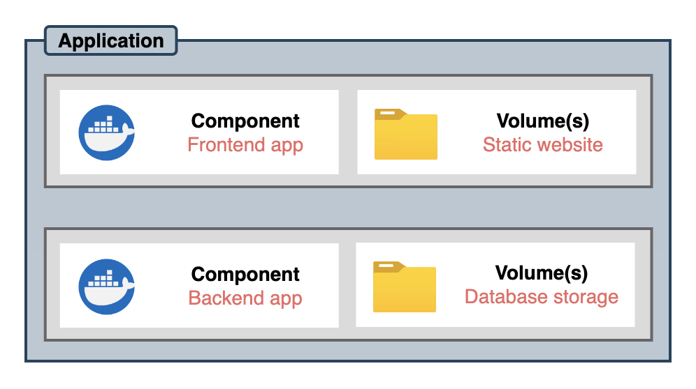

# Getting started

## Anatomy of a mdos application

### Applications & application components

Applications are to be seen as a higher level concept that is composed of one or more application components. Application components are your actual projects, where one component would be your API backend server, and a second component would hold your front end application for instance.  
Every application component can have one or more volumes attached to it for storage persistance & data mirroring. 



This architecture allows you to compose complex applications to suit your needs.

### Project layout

A MDos application project layout is composed of one or more folders, each one representing an application component.  
At the root of the application folder is a `mdos.yaml` file that holds all runtime configuration parameters for the application and it's components:

```title="Project structure"
my-application/
├── backend
│   └── Dockerfile
├── frontend
│   └── Dockerfile
├── volumes
│   └── static-website
└── mdos.yaml
```

In this example we have an application named `my-application`, that is composed of two distinct application components: `backend` & `frontend`.  
Each component has it's own Dockerfile.  
At the `application` level, there is also a `volumes` folder where you can store application component volume files to be used within your application, and a `mdos.yaml` config file that holds all runtime configuration parameters. As an example, here the `volumes` folder has a subfolder called `static-website` that is used by the `frontend` application so serve it's website data.

> **Note**
> Volumes are managed on the `application` level rather than on the `component` level in case you wish to share volumes amongst components.

We will build a similar `hello world` example application now, but to keep thinks simple, we will not deploy a backend component along with the frontend component.  
But first, we need to configure our MDos CLI so that it knows how to talk to our MDos API server.

## Configure your CLI to point to a MDos platform API host

The mdos CLI needs to know to what MDos API server to talk to first.

> **Warning**
> If you installed the platform using a self-signed certificate without any valid domain names configured, then you will have to ensure that all required platform hostnames are configured on your local machine `hosts` file before you prosceed.  
> In Linux and Mac OSX, your can configure those in your `/etc/hosts` file. In Windows, this file is located under `c:\Windows\System32\Drivers\etc\hosts`.  
> For more information, please refer to the chapter [Special notes about self-signed certificates without a resolvable DNS name]()

To configure the target MDos platform domain name with your CLI, use the following command:

```
mdos set domain mydomain.com
```

> Replace `mydomain.com` by your actual domain name used during the platform installation procedure.

If your MDos installation uses a self signed certificate, then you will have to switch over to `api` based authentication mode rather than OIDC SSO authentication. To do so, simply configure your CLI using the following command:

```
mdos set auth-mode api
```

You are now ready to start using the platform.

## Create a tenant namespace

In Kubernetes, `namespaces` are used to group assets together so that they can be properly administered & run in their own scoped context.  
In MDos, we assign a dedicated `namespace` to each tenant on the platform. Applications belong to a tenant namespace, without the namespace we can not deploy our application.  

To create a new tenant nameespace, run the following command:

```
mdos namespace create
```

> If this is the first time you interact with the platform (or if your JWT token has expired), you will be asked to authenticate yourself first. In our case, we did not add any platform users yet, so we will simply use the `admin` user account that was used during the platform installation procedure. If you do already have your own user account on the platform, and you have sufficient permissions to create new tenant namespaces and deploy applications, then please go ahead and use this one instead.  
> Depending on your authenication mode, you will be prompted by the CLI to enter your credentials directly, or your browser will automatically open so that you can authenticate yourself using `Keycloak`. If OIDC is used for authentication, then you will be presented with your secure JWT token that you need to paste back into the CLI to complete your authentication procedure.

You will be prompted to enter a name for this new namespace. Please do so, and hit enter when done.

## Scaffold an application & application components

### Create a new application

Let's create a new application project using the `mdos` CLI command:

```sh
mdos generate application
```

```yaml linenums="1"
Under construction
```

This will create a new folder with the `mdos.yaml` configuration file in it. We are now ready to create application components.

### Create a new application component

Inside your application project folder, run the following command:

```sh
mdos generate component
```

The CLI will ask you a couple of things about some base configuration parameters.
This will create a new component folder with an empty `Dockerfile` for you to use, as well as update the `mdos.yaml` file referencing the component as part of the overall application project along with it's configuration parameters.  
You can no go ahead and build & test your application locally, and complete the `Dockerfile` that will be used to build your component application image for deployment onto the cluster.

## Deploy your application