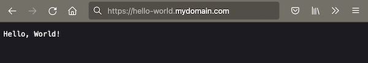

# Getting started

## Anatomy of a mdos application

Applications are to be seen as a higher level concept that is composed of one or more application components. Application components are your actual projects, where one component would be your API backend server, and a second component would hold your front end application for instance and so on.  
Every application component can have one or more volumes attached to it for storage persistance & data mirroring. 


This architecture allows you to compose complex applications to suit your needs.

A MDos application project layout is composed of one or more folders, each one representing an application component.  
At the root of the application folder is a `mdos.yaml` file that holds all runtime configuration parameters for the application and it's components:

```title="Project structure"
my-application/
├── backend
│   └── Dockerfile
│   └── <your application code files>...
├── frontend
│   └── Dockerfile
│   └── <your application code files>...
├── volumes
│   └── static-website
│       └── index.html
│       └── ...
└── mdos.yaml
```

In this example we have an application named `my-application`, that is composed of two distinct application components: `backend` & `frontend`.  
Each component has it's own Dockerfile.  
At the `application` level, there is also a `volumes` folder where you can store application component volume files to be used within your application, and a `mdos.yaml` config file that holds all runtime configuration parameters. As an example, here the `volumes` folder has a subfolder called `static-website` that is used by the `frontend` application so serve it's website data.

> **Note**
> Volumes are managed on the `application` level rather than on the `component` level in case you wish to share volumes amongst components.

We will build a similar `hello world` example application now, but to keep thinks simple, we will not deploy a backend component along with the frontend component, and not work with volumes yet. Those will be subjects for later on.  

First, we need to configure our MDos CLI so that it knows how to talk to our MDos API server.

## Configure your CLI to point to a MDos platform API host

Before we can start using the mdos CLI, we need to tell it what MDos API server to talk to.

> **Warning**
> If you installed the platform using a self-signed certificate without any valid domain names configured, then you will have to ensure that all required platform hostnames are configured on your local machine `hosts` file before you prosceed.  
> In Linux and Mac OSX, your can configure those in your `/etc/hosts` file. In Windows, this file is located under `c:\Windows\System32\Drivers\etc\hosts`.  
> For more information, please refer to the chapter [Special notes about self-signed certificates without a resolvable DNS name]()

To configure the target MDos platform API server endpoint with your CLI, use the following command:

```
mdos configure api-endpoint api.mydomain.com
```

Replace `mydomain.com` with your actual domain name used during the platform installation procedure.  

You are now ready to start using the platform.

## Create a tenant namespace

In Kubernetes, `namespaces` are used to group assets together so that they can be properly administered & run in their own scoped context.  
In MDos, we assign a dedicated `namespace` to each tenant on the platform. Applications belong to a tenant namespace, without the namespace we can not deploy our application.  

To create a new tenant namespace called `a-team`, run the following command:

```
mdos namespace create

WARN : Your current token has expired or is invalid. You need to re-authenticate

? Please enter your username: admin-username
? Please enter your password: [hidden]

? Enter a namespace name to create a-team
Creating namespace... done
```

> If this is the first time you interact with the platform (or if your JWT token has expired like in the example above), you will be asked to authenticate yourself first. In our case, we did not add any platform users yet, so we will simply use the `admin` user account that was used during the platform installation procedure (in this example, the admin username is called `admin-username`, super original, I know...).  
> If you do already have your own user account on the platform, and you have sufficient permissions to create new tenant namespaces and deploy applications, then please go ahead and use this one instead.  

So what happened on the platform side when you create a namespace using the MDos CLI? Here are some high level details:

1. Create a new Client in Keycloak, required to manage users that will interact with this namespace
2. Create available default roles for this Keycloak client / namespace (`admin`, `k8s-write`, `k8s-read`, `ftp-write`, `registry-pull`, `registry-push`)
3. Create namespace in Kubernetes
4. Create namespace roles so that we can apply RBAC permissions to users
5. Configure service account / credentials in Keycloak for `ftpd` and `registry` access for this namespace

> Details about these concepts are out of scope in this chapter

## Scaffold an application & application components

### Create a new application

Let's create a new application project using the `mdos` CLI command:

```sh
mdos generate application
? Enter a application name: hello-world
? Enter a tenant name that this application belongs to: a-team
```

This will create a new folder with the `mdos.yaml` configuration file in it. We are now ready to create application components.

### Create a new application component

Inside your application project folder, run the following command:

```sh
cd hello-world

mdos generate component
? Enter a application component name: hello-world-server
```

The CLI will ask you a couple of things about some base configuration parameters.
This will create a new component folder with an empty `Dockerfile` for you to use, as well as update the `mdos.yaml` file referencing the component as part of the overall application project along with it's configuration parameters.  

You can now go ahead and implement your `hello-world-server` application component. Let's do just that. We will create a basic NodeJS HTTP server for this demonstration that will return "hello world" when invoked.  

Create a new file: `hello-world/hello-world-server/index.js` 

```javascript
const http = require('http'); // Loads the http module 

http.createServer((request, response) => {
    
    // 1. Tell the browser everything is OK (Status code 200), and the data is in plain text
    response.writeHead(200, {
        'Content-Type': 'text/plain'
    });

    // 2. Write the announced text to the body of the page
    response.write('Hello, World!\n');

    // 3. Tell the server that all of the response headers and body have been sent
    response.end();

}).listen(8080); // 4. Tells the server what port to be on

```

Last but not least, we need to populate our component `Dockerfile` so that we can build our container image during deployments. Open the `Dockerfile` that is inside the `hello-world-server` folder and set it's content to the following:

```dockerfile
FROM node:16

# Create app directory
WORKDIR /usr/src/app

# Bundle app source
COPY ./server.js .

EXPOSE 8080
CMD [ "node", "server.js" ]
```

Ok, we have an application ready to use now. Next, we need to tell out `mdos` application that we want to expose port `8080`, and set up an ingress config to expose it outside of the cluster using the hostname `hello-world.mydomain.com`.

> **Note**
> As of now, MDos uses the platform wildcard domain name that was configured during the installation of the platform in order to exposes any application you deploy on it. Adding extra domain names for your various applications is under developement and will be available soon. 

Let's start with exposing port `8080`. Move into the `hello-world-server` component folder and execute the following command:

```
mdos generate port
? Enter a name for the service to add a port to: http
? Specify a port number on which your application needs to be accessible on: 8080
```

And finally, the ingress so that we have a hostname configured to access this application:

```
mdos generate ingress
? Enter a name for the ingress: http-ingress
? What hostname do you want to use to access your component port: hello-world.mydomain.com
? Do you want to match a subpath for this host? No
? What target port should this traffic be redirected to? 8080
? What type of traffic will this ingress handle? http
```

> Again, replace `mydomain.com` with whatever domain you configured during the platform installation.

That's it, this is what your project file structure should look like now:

```
hello-world
├── hello-world-server
│   ├── Dockerfile
│   └── server.js
├── mdos.yaml
└── volumes
    └── README.md
```

Let's have a look at the generated code in the `mdos.yaml` file:

```yaml
schemaVersion: v1
tenantName: a-team
appName: hello-world
uuid: mvx10-x2wip
components:
  - name: hello-world-server
    image: hello-world
    uuid: qx8su-jwqvi
    tag: 0.0.1
    services:
      - name: http
        ports:
          - port: 8080
    ingress:
      - name: http-ingress
        matchHost: hello-world.mydomain.com
        targetPort: 8080
        trafficType: http
```

> **Note**
> All application configuration features will live inside this `yaml` file, even for the most advanced use-cases and config needs, everything will be here. No need to get dirty with low level kubernetes assets to make it all happen, the platform will translate it all into the proper artefacts for you.  
> To learn more about everything that you can configure for your deployments in this yaml file, please refer back to the specific documentation chapters

## Deploy your `hello-world` application on the cluster

> **Note**
> Since this is a basic example, we will skip user management, authentication or any other advanced topics for now. Since we authenticated with the MDos admin user account, we can deploy onto this namespace without creating / assigning users & permissions for this namespace.

Move into the `hello-world` application and execute the command:

```
mdos application deploy

WARN : Your current token has expired or is invalid. You need to re-authenticate

? Please enter your username: admin-username
? Please enter your password: [hidden]

Synching volumes... done

To push your images to the mdos registry, you need to provide your mdos username and password first

? Username: admin-username
? Password: ********
Building application image registry.mydomain.com/a-team/hello-world:0.0.1... done
Pushing application image registry.mydomain.com/a-team/hello-world:0.0.1... done
Deploying application... scheduled

Pod: hello-world-server
    Phase: Running
    Container: hello-world-hello-world-server
        State: running
        Details: n/a

SUCCESS : Application deployed
```

That's it, your application should now be accessible on the following domain: `https://hello-world.mydomain.com`


