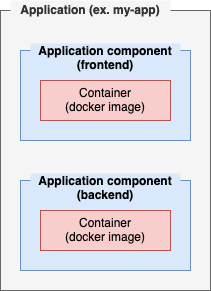

---
hide:
  - navigation
---

# Getting started

## Anatomy of a mdos application

### Applications & application components

Applications are to be seen as a higher level concept that is composed of one or more application components. Application components are your actual projects, where one component would be your API backend server, another might be a database server and a third one your front end application for instance.



This architecture allows you to compose quite complex applications to suit most needs.

### Project layout

A MDos application project layout is composed of one or more folders, each one representing an application component.  
At the root of the application folder is a `values.yaml` file that holds all runtime configuration parameters for the application and it's components:

```title="Project structure"
my-application/
├── backend
│   └── Dockerfile
├── frontend
│   └── Dockerfile
└── values.yaml
```

In this example we have an application named `my-application`, that is composed of two distinct application components: `backend` & `frontend`.  
Each component has it's own Dockerfile.  
At the `application` level, there is also a `values.yaml` config file that holds all runtime configuration parameters for the application:

```yaml linenums="1"
appUUID: 8c259ee5-d70f-409b-8eea-3f410e385d0f
tenantName: my-ns
appName: my-app
appComponents:
  - name: backend
    appCompUUID: 552be6bf-4a8d-4003-aeb2-9999a535c299
    replicaCount: 1
    # Your image name and tag
    image:
      repository: backend
      tag: latest
    # Overwrite the default command for your docker image
    overwriteCommand: false
    command: []
    commandArgs: []
    # Services
    service:
      create: true
      type: ClusterIP
      portMappings:
        - port: 80
          containerPort: 80
    # Configure ingress for your application component
    virtualService:
      - gateway: http-gateway
        hosts:
          - backend.yourdomain.com
        protocol: http
        httpMatch:
          prefix: /
          port: "80"
        svcPort: "80"
    # - gateway: http-gateway | https-gateway | <other>
    #   hosts:
    #     - chart-example.com
    #   protocol: https # http / https / tls / tcp
    #   tlsMatchHosts: # only for tls/https route
    #     - host: chart-example.com
    #       port: 443
    #       svcPort: 8443
    #   httpMatch: # only for http route
    #     prefix: /
    #     port: 80
    #   tcpMatchPorts: # only for tcp
    #     - 27017
    #   svcPort: 80
    #   tls: []

    # Configuration parameters
    config:
      enabled: false
      data: {}
      # data:
      #   - type: file # will be mounted as a file inside the pod
      #     key: test.config
      #     value: "Content of test.config file"
      #     mountPath: "/etc/myApp/config/"
      #   - type: env # will be mounted as an ENV var inside the pod
      #     key: TEST_ENV
      #     value: "Value of ENV variable TEST_ENV"
    # Secret configuration parameters
    secrets:
      enabled: false
      data: {}
      # data:
      #   - type: file
      #     key: test.secret
      #     value: "Content of test.secret file"
      #     mountPath: "/etc/myApp/config/"
      #   - type: env
      #     key: SECRET_ENV
      #     value: "Value of ENV variable SECRET_ENV"
    # Persist data to a persistent volume
    persistence:
      enabled: false
      # volumes:
      #   - name: data-volume
      #     size: 1Gi
      #     mountPath: /tmp
      #     ldlSync: false
      #     sourcePath: /mdos/content-volumes/app1 # path from where data should be collected (ONLY used with ldlSync=true)
      #     type: full # full / partial depending on the type of file copy (ONLY used with ldlSync=true)
      # hostpathVolumes:
      #   - name: host-data-volume
      #     mountPath: /tmp
      #     hostPath: /mdos/content-volumes/app1
      #     type: Directory
    resources: {}
    # limits:
    #   cpu: 100m
    #   memory: 128Mi
    # requests:
    #   cpu: 100m
    #   memory: 128Mi

  - name: frontend
    appCompUUID: 5515dedf-9c1e-4afb-9f20-5238bfbd5256
    replicaCount: 1
    # Your image name and tag
    image:
      repository: frontend
      tag: latest
    # Overwrite the default command for your docker image
    overwriteCommand: false
    command: []
    commandArgs: []
    # Services
    service:
      create: true
      type: ClusterIP
      portMappings:
        - port: 80
          containerPort: 80
    # Configure ingress for your application component
    virtualService:
      - gateway: http-gateway
        hosts:
          - frontend.yourdomain.com
        protocol: http
        httpMatch:
          prefix: /
          port: "80"
        svcPort: "80"
    # - gateway: http-gateway | https-gateway | <other>
    #   hosts:
    #     - chart-example.com
    #   protocol: https # http / https / tls / tcp
    #   tlsMatchHosts: # only for tls/https route
    #     - host: chart-example.com
    #       port: 443
    #       svcPort: 8443
    #   httpMatch: # only for http route
    #     prefix: /
    #     port: 80
    #   tcpMatchPorts: # only for tcp
    #     - 27017
    #   svcPort: 80
    #   tls: []

    # Configuration parameters
    config:
      enabled: false
      data: {}
      # data:
      #   - type: file # will be mounted as a file inside the pod
      #     key: test.config
      #     value: "Content of test.config file"
      #     mountPath: "/etc/myApp/config/"
      #   - type: env # will be mounted as an ENV var inside the pod
      #     key: TEST_ENV
      #     value: "Value of ENV variable TEST_ENV"
    # Secret configuration parameters
    secrets:
      enabled: false
      data: {}
      # data:
      #   - type: file
      #     key: test.secret
      #     value: "Content of test.secret file"
      #     mountPath: "/etc/myApp/config/"
      #   - type: env
      #     key: SECRET_ENV
      #     value: "Value of ENV variable SECRET_ENV"
    # Persist data to a persistent volume
    persistence:
      enabled: false
      # volumes:
      #   - name: data-volume
      #     size: 1Gi
      #     mountPath: /tmp
      #     ldlSync: false
      #     sourcePath: /mdos/content-volumes/app1 # path from where data should be collected (ONLY used with ldlSync=true)
      #     type: full # full / partial depending on the type of file copy (ONLY used with ldlSync=true)
      # hostpathVolumes:
      #   - name: host-data-volume
      #     mountPath: /tmp
      #     hostPath: /mdos/content-volumes/app1
      #     type: Directory
    resources: {}
    # limits:
    #   cpu: 100m
    #   memory: 128Mi
    # requests:
    #   cpu: 100m
    #   memory: 128Mi
```

This is where you configure things like volumed, environement variables, secrets such as API tokens or credentials... The generated `values.yaml` file contains examples of these properties.

> The `mdos` CLI will allow you to scafold / create application projects and application components, as well as build and deploy them to your Kubernetes cluster.

## Build applications for the platform

### Create a new application

Let's create a new application project using the `mdos` CLI command:

```sh
mdos generate application
```

This will create a new folder with the `values.yaml` configuration file in it. We are now ready to create application components.

### Create a new application component

Inside your application project folder, run the following command:

```sh
mdos generate component
```

The CLI will ask you a couple of things about some base configuration parameters.
This will create a new component folder with an empty `Dockerfile` for you to use, as well as update the `values.yaml` file referencing the component as part of the overall application project along with it's configuration parameters.  
You can no go ahead and build & test your application locally, and complete the `Dockerfile` that will be used to build your component application image for deployment onto the cluster.

## Deploy application on the platform

### Build your application

### Deploy your application
