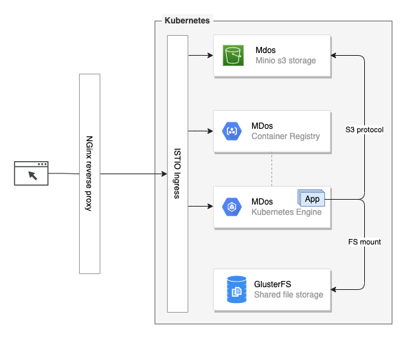
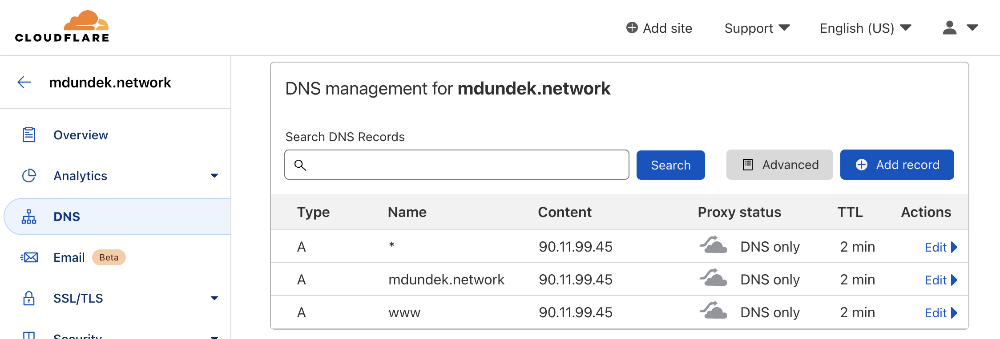

# Installation & setup

## Install the MDos CLI

The easiest way to install the platform is to use the MDos CLI. Do do so, you will have to clone the repo on your target machine:

```sh
git clone https://github.com/mdundek/mdos.git
```

Then install the CLI by executing the following script:

```sh
./mdos/cli/install/01_setup_mdos_cmd.sh
```

During the installation of the CLI, you will be asked to enter your main domain name.  

> _Ex. yourdomain.com_  
> _Enter your root domain name: `yourdomain.com`_

Once done, execute the following command to reload your aliases for the mdos CLI:

```sh
source ~/.bashrc
```

## Set up the MDos platform

To install the platform, you can use the `mdos` CLI to do so. For a more granual installation, the setup is split into multiple steps:

* Install and create your `Cloudflare - Certbot SSL certificate` & auto-renewal for your domain
* Install `Code-server` so that you can develop your applications using your favorite browser
* Install the `K3S & Calico` application runtime environement
* Install `HELM` for Kubernetes
* Install `Istio` for ingress
* Install a local `NGinx` server as a reverse proxy for your platform (also used to load-balance between nodes if you have more than one)
* Install a local `private Docker regisytry` on the K3S cluster
* Install `Pure-ftpd` stack using docker-compose

<!--  -->

> NOTE: The GlusterFS shared filesystem is not available at the moment, this is planned for future releases.

The CLI command that will allow you to install each one of these components is `mdos core-setup`:


> You need to execute each one of those commands in the right order. Each component might ask for extra parameters to accomplish it's specific setup.

### 01 - Cloudflare & certbot SSL

Select `01_certbot` as the target installation step. You will be asked to enter your:

* Cloudflare email address
* Cloudflare API token

Your SSL certificate is now setup and will automatically renew when necessary.  
Your crontab has also been updated to automatically update your public IP address on Cloudflare.

#### Router config

> Make sure you configured your router to route ports 80 & 443 to this machine before moving forward with this script.  

#### Cloudflare DNS config 
  
> Also make sure your domain is configured on CloudFlare:
> 

#### Cloudflare API config

> Create a CloudFlare API key as well, you will need it here (`My Profile -> API Token`):  
> 


### 02 - Code-server setup

Select `02_codeserver` as the target installation step. You will be asked to specify a code-server password.

> Once done, your code-server instance will be up and running, but you will have to wait untill you set up NGinx before being able to access it.  
> Once that is done, you will be able to access your Code-server instance on the following URL: `https://cs.<your domain>`

### 03 - K3S & Calico setup

Select `03_k3s` as the target installation step. You will be asked to enter your:

* The private docker registry username
* The private docker registry password

> Those will be used to set up your self signed registry certificate, along with your docker daemon and K3S containerd exceptions for the certificate.

### 04 - HELM setup

Select `04_helm` as the target installation step.  
This is straight forward, HELM is used to install applications on the mdos platform.

### 05 - Istio Ingress setup

Select `05_istio` as the target installation step. 

> If you update the istio HELM yaml files, make sure to set the ingress-gateway nodeports to 30977 (status-port), 30978 (http2) & 30979 (https) in the yaml file `files/istio_helm/gateways/istio-ingress/values.yaml`

### 06 - NGinx reverse proxy setup

Select `06_nginx` as the target installation step. You will be asked to enter your:

* WAN facing username
* WAN facing password

This NGinx server will capture traffic on port 443 on your machine, and forward this traffic to your local code-server, as well as to all applications running on your K3S cluster. Segregagtion happens on the HOST subdomain used with your CloudFlare main domain name.  
Unless configured otherwise, the NGinx server will also enforce user authentication for all application it serves except for Minio who comes with's it's own authentication mechanism.

> NOTE: NGinx is installed navively on the host, rather than as a container in the cluster. 

### 07 - Private docker registry setup

Select `07_registry` as the target installation step. 

> This registry is used by Kubernetes to store and distribute your private application images

### 08 - Minio S3 backup server setup

Select `08_minio` as the target installation step. You will be asked to enter your:

* The minio storage path to use
* Minio ACCESS_KEY to use
* Minio SECRET_KEY to use

> Once that is done, you will be able to access:
>  
> * The Minio console: `https://minio-console.<your domain>`
> * The Minio S3 server: `https://minio-backup.<your domain>`

## Extra

### disk mounts

```sh title="Example of disk mounts in linux"
# Create mount folders
mkdir /media/storage
mkdir /media/multimedia
mkdir /media/backup

# Get partition UUIDs
lsblk -o NAME,FSTYPE,UUID

# Open fstab file
vi /etc/fstab

echo "UUID=5dd2af09-b490-43bf-a688-e8c5f6a557ef /media/storage ext4 defaults 0 2" >> /etc/fstab
echo "UUID=445d3106-669d-492e-b537-b444e9a666b2 /media/multimedia ext4 defaults 0 2" >> /etc/fstab
echo "UUID=67643a4b-4bb9-45b2-9530-838bb48deb05 /media/backup ext4 defaults 0 2" >> /etc/fstab

mount -a
```