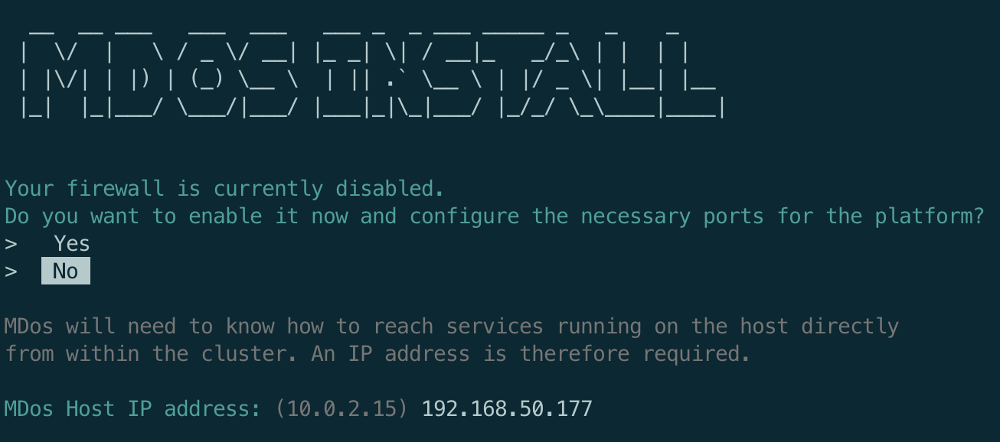
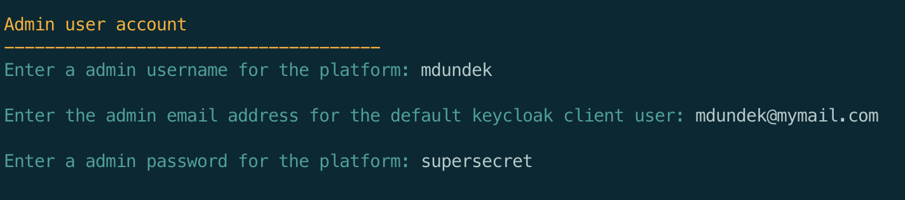
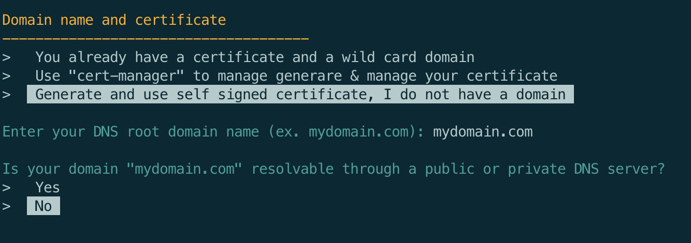
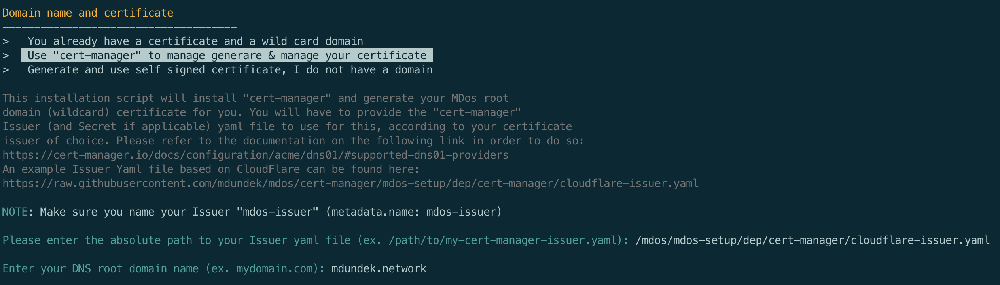
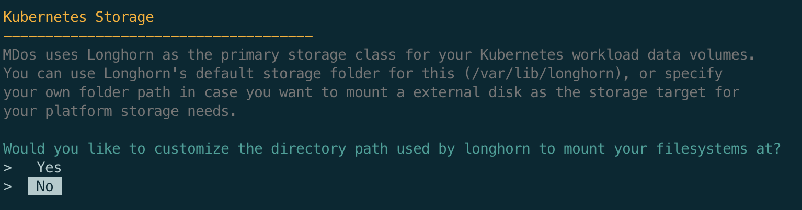
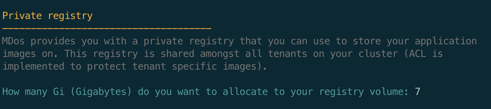
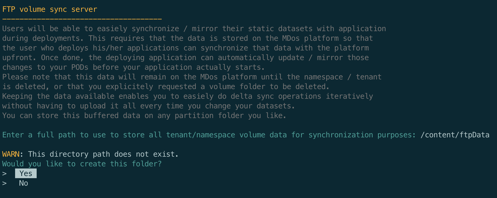

# Installation & setup

## Install the MDos (server) platform

> **Warning**
> At the moment, only Ubuntu >= 20.04 is supported for the MDos platform itself. Debian and Alpine are planned next.
> The MDos CLI is available for Max, linux and Windows

First, clone this repo on your target machine:

```sh
git clone https://github.com/mdundek/mdos.git
```

### Master node & MDos control plane

Install the platform by calling the following script as root:

```sh
sudo ./mdos-setup/install.sh
```

During the installation procedure, you will be asked to provide a few details. You will have to start by providing your MDos platform host IP address. Then select if you would like to automatically configure the host firewall in order to allow the required traffic policies for MDos.



#### Administrator credentials 

The platform will create a overall admin account on the platform. Please provide the admin username, email and password first:



#### Domain & certificate setup

Some of the components such as the registry auth server require a TLS certificate to function.  
The installation script will give you multiple choices here:

1. You have a valid certificate at hand that you would like to use
2. You want to set up `cert-manager` to generate and manage your certificate (Let's Encrypt, CloudFlare, Vault, AWS, Google...)
3. You have no certificate and would like to create a self-signed certificate (only suited for developement purposes)

> **Warning**
> For developement purposes, you can have the platform generate a self signed certificate for you, but SSO / OIDC functionality will not work with a self-signed certificate.  
> For production, you will have to use a fully valid certificate in order to use all of MDos features. 



This example is based on the 3rd option, a self signed certificate. If you want to use `cert-manager` instead (good option for production environement), you will be asked to enter the path to your cert-manager `Issuer` Yaml file to use in order to issue your certificate.



> **Note**
> Your `Issuer` must use the name `mdos-issuer`, the rest is up to you. Here is an example Issuer yaml file that uses `CloudFlare` as the DNS registrar & `Let's Encrypt` to generate and sign your certificate:
> > ```
> > 
> > ```

#### Kubernetes workload storage directory path

When you deploy applications onto your Kubernetes cluster, chances are that your applications will require to use permanent / persisted storage. Containers by default do not persist data beyond a container restart, You will therefore have to persist your container data on Kubernetes managed storage.  
MDos uses `Longhorn` from Rancher for this as a storage class. Longhorn will allocate your container volumes in a dedicated directory on each Cluster Node. This is your chance to customize this directory path in case you want to store this data on an external hard drive that you mounted onto your host system:



#### Private registry max size

MDos comes with a private registry where you can store your images on. The Kubernetes cluster is configured to use this registry if that's what you want to do in order to keep your images inhouse. This is also a must if you intend to run the platform in offline mode.  
The registry runs in Kubernetes, it therefore needs to allocate some storage to it so that it can persist it's data on your disk. Here you need to specify how much space you wish to allocate to this registry (in Gigabytes).



> **Note**
> Please note that this storage capacity will be located on your main Kubernetes storage path specified above

#### FTP sync server for Kubernetes POD data provisionning

When running applications in kubernetes using CSI storage plugins, you usually end up with a blank volume once your pod starts for the first time. This is usually a pain point for many developers who end up using `hostPath` mount points instead. This is an antipatern and does not go well with multi-node cluster environements where you can not easiely predict where your pod is going to start.  
MDos provides you with a means to initialize your application pods with data pre-alocated to it's volumes. This can be very usefull for usecases such as (but not only):

* Provision a volume with a already pre-established database schema and data set for initialization purposes (or any other type of initialization data sets)
* Provision static data such as websites
* or for anything else for that matter...

This is achieved by providing a centralized storage space on the mdos platform where a FTP server will allow you to (using the mdos CLI) mirror your application volume data from your local machine to the centralized FTP storage device where Kubernetes will then mirror those data volumes onto your POD volumes using `initContainers` and the FTP protocol.  
Here you are being asked to provide a directory path to where this centralized data will be hosted.  
Again, this is your chance to customize this directory path in case you want to store this data on an external hard drive that you mounted onto your host system:



#### Configure Keycloak and set up the master token

After a few minutes (can take up to 10 minutes, depending on your internet speed), you will be asked to set up Keycloak and provide a secret token to the installation script.   
This token is necessary so that mdos can administer everything it needs on Keycloak.  
The script provides you with detailed instructions on how to do so, simply follow them and enter the secret `token` from the Keycloak website.

```
To finalyze the setup, do the following:

  1. Open a browser and go to:
     https://keycloak.mydomain.com/admin/master/console/#/realms/master/clients
  2. From the 'Clients' section, click on the client 'master-realm'
  3. Change 'Access Type' value to 'confidential'
  4. Enable the boolean value 'Service Accounts Enabled'
  5. Set 'Valid Redirect URIs' value to '*'
  6. Save those changes (button at the bottom of the page)
  7. In tab 'Roles', Click on button 'edit' for role 'magage realm'.
     Enable 'Composite roles' and add 'admin' realm to associated roles
  8. Go to the 'Service Account Roles' tab and add the role 'admin' to the 'Assigned Roles' box
  9. Click on tab 'Credentials'
 10. When ready, copy and paste the 'Secret' value into this terminal, then press enter:

SECRET: cXXyx8EtGGL8BgCC9zVYQidKYuctzuXA
```

That's it, once the installation script is finished you are ready to use the platform.


### Worker nodes

> **Note**
> Under construction

---

## Install the MDos CLI

### Linux & Mac OSX

The standalone install is a simple tarball with a binary. It contains its own node.js binary and autoupdates.

To set up the CLI in `/usr/local/lib/mdos` and `/usr/local/bin/mdos`, run the following script. The script requires sudo and **isn’t Windows compatible**.

```sh
curl https://raw.githubusercontent.com/mdundek/mdos/main/mdos-cli/infra/install-linux-mac.sh | sh
```

### Windows

> **Note**
> Under construction

### Verify Your Installation

To verify your CLI installation, use the mdos --version command:

```
mdos --version
mdos-cli/0.0.0 linux-x64 node-v18.9.0
```

### Special notes about self-signed certificates without a resolvable DNS name

For developement purposes, you can use self-signed certificates without a publicly available DNS name. That said, you will have to configure your `hosts` file from wherever you wish to use the CLI from so that it can resolve the various hostnames used by the MDos API platform.

> **Note**
> Please replace `XXX.XXX.XXX.XXX` with the MDos Platform server IP address, and `mydomain.com` with the actual domain used when you deployed the MDos platform. 

#### Linux & Mac OSX

Open your `/etc/hosts` file (root user) and add the following entries to it:

```
XXX.XXX.XXX.XXX registry.mydomain.com registry-auth.mydomain.com mdos-api.mydomain.com mdos-ftp.mydomain.com mdos-ftp-api.mydomain.com longhorn.mydomain.com
```

> **Note**
> Please replace `XXX.XXX.XXX.XXX` with the MDos Platform server IP address, and `mydomain.com` with the actual domain used when you deployed the MDos platform. 

#### Windows

Open your `c:\Windows\System32\Drivers\etc\hosts` file (root user) and add the following entries to it:

```
XXX.XXX.XXX.XXX registry.mydomain.com
XXX.XXX.XXX.XXX registry-auth.mydomain.com
XXX.XXX.XXX.XXX mdos-api.mydomain.com
XXX.XXX.XXX.XXX mdos-ftp.mydomain.com
XXX.XXX.XXX.XXX mdos-ftp-api.mydomain.com
XXX.XXX.XXX.XXX longhorn.mydomain.com
```

<!-- ## Extra

### disk mounts

```sh title="Example of disk mounts in linux"
# Create mount folders
mkdir /media/storage
mkdir /media/multimedia
mkdir /media/backup

# Get partition UUIDs
lsblk -o NAME,FSTYPE,UUID

# Open fstab file
vi /etc/fstab

echo "UUID=5dd2af09-b490-43bf-a688-e8c5f6a557ef /media/storage ext4 defaults 0 2" >> /etc/fstab
echo "UUID=445d3106-669d-492e-b537-b444e9a666b2 /media/multimedia ext4 defaults 0 2" >> /etc/fstab
echo "UUID=67643a4b-4bb9-45b2-9530-838bb48deb05 /media/backup ext4 defaults 0 2" >> /etc/fstab

mount -a
``` -->